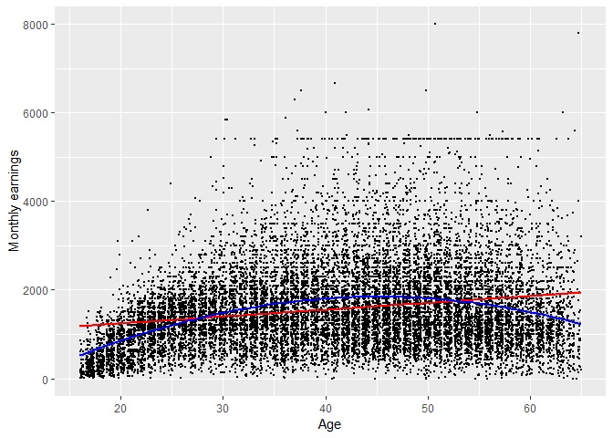
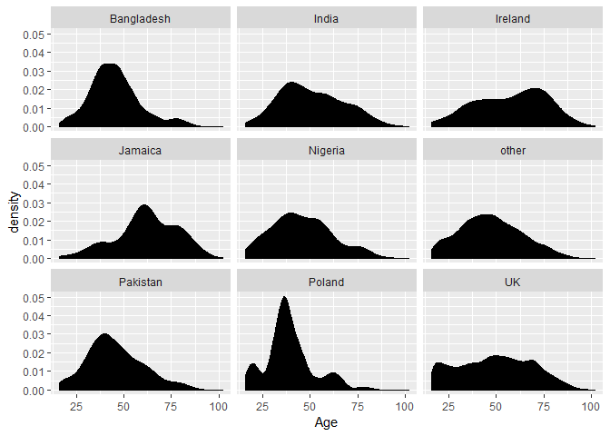
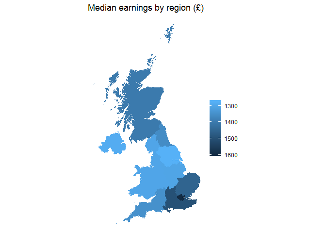

Statistical assignment 4
================
\[add your name here\] \[add your candidate number here - mandatory\]
\[add date here\]

In this assignment you will need to reproduce 5 ggplot graphs. I supply graphs as images; you need to write the ggplot2 code to reproduce them and knit and submit a Markdown document with the reproduced graphs (as well as your .Rmd file).

First we will need to open and recode the data. I supply the code for this; you only need to change the file paths.

    ```r
    library(tidyverse)
    Data8 <- read_tsv("C:\\Users\\ab789\\datan3_2019\\data\\UKDA-6614-tab\\tab\\ukhls_w8\\h_indresp.tab")

    Data8 <- Data8 %>%
        select(pidp, h_age_dv, h_payn_dv, h_gor_dv)

    Stable <- read_tsv("C:\\Users\\ab789\\datan3_2019\\data\\UKDA-6614-tab\\tab\\ukhls_wx\\xwavedat.tab")

    Stable <- Stable %>%
        select(pidp, sex_dv, ukborn, plbornc)

    Data <- Data8 %>% left_join(Stable, "pidp")

    rm(Data8, Stable)

    Data <- Data %>%
        mutate(sex_dv = ifelse(sex_dv == 1, "male",
                           ifelse(sex_dv == 2, "female", NA))) %>%
        mutate(h_payn_dv = ifelse(h_payn_dv < 0, NA, h_payn_dv)) %>%
        mutate(h_gor_dv = recode(h_gor_dv,
                         `-9` = NA_character_,
                         `1` = "North East",
                         `2` = "North West",
                         `3` = "Yorkshire",
                         `4` = "East Midlands",
                         `5` = "West Midlands",
                         `6` = "East of England",
                         `7` = "London",
                         `8` = "South East",
                         `9` = "South West",
                         `10` = "Wales",
                         `11` = "Scotland",
                         `12` = "Northern Ireland")) %>%
        mutate(placeBorn = case_when(
                ukborn  == -9 ~ NA_character_,
                ukborn < 5 ~ "UK",
                plbornc == 5 ~ "Ireland",
                plbornc == 18 ~ "India",
                plbornc == 19 ~ "Pakistan",
                plbornc == 20 ~ "Bangladesh",
                plbornc == 10 ~ "Poland",
                plbornc == 27 ~ "Jamaica",
                plbornc == 24 ~ "Nigeria",
                TRUE ~ "other")
        )
    ```

Reproduce the following graphs as close as you can. For each graph, write two sentences (not more!) describing its main message.

1.  Histogram (20 points)

    ``` r
    Data %>%
        ggplot(aes(x = h_age_dv)) +
        geom_histogram(binwidth = 1) +
        xlab("Age") +
        ylab("Number of respondents")
    ```

    

2.  Scatter plot (20 points). The red line shows a linear fit; the blue line shows a quadratic fit. Note the size and position of points.

    ``` r
    Data %>% 
            ggplot(aes(x = h_age_dv, y = h_payn_dv)) +
            geom_point(size = 0.1, position = "jitter") +
            geom_smooth(method = "lm", colour = "red") +
            geom_smooth(method = "lm", formula = y ~ x + I(x^2), colour = "blue") +
            xlim(16, 65) +
            xlab("Age") +
            ylab("Monthly earnings")
    ```

    

3.  Faceted density chart (20 points).

    ``` r
    Data %>%
        filter(!is.na(placeBorn)) %>%
        ggplot(aes(x = h_age_dv)) +
        geom_density(fill = "black") +
        xlab("Age") +
        facet_wrap(~ placeBorn)
    ```

    

4.  Ordered bar chart of summary statistics (20 points).

    ``` r
    Data %>%
        filter(!is.na(placeBorn)) %>%
        filter(!is.na(sex_dv)) %>%
        group_by(placeBorn, sex_dv) %>%
        summarise(
                medianIncome = median(h_payn_dv, na.rm = TRUE)
        ) %>%
        ggplot(aes(x = reorder(placeBorn, medianIncome), y = medianIncome, fill = sex_dv)) +
        geom_bar(stat = "identity", position = "dodge") +
        scale_fill_manual(values = c("darkred", "darkblue")) +
        coord_flip() +
        ylab("Median net monthly earnings") +
        xlab("Country of birth") +
        theme(legend.position="top") +
        guides(fill=guide_legend(reverse=TRUE)) +
        labs(fill="")
    ```

    

5.  Map (20 points). This is the most difficult problem in this set. You will need to use the NUTS Level 1 shape file (available here -- <https://data.gov.uk/dataset/2aa6727d-c5f0-462a-a367-904c750bbb34/nuts-level-1-january-2018-full-clipped-boundaries-in-the-united-kingdom>) and a number of packages for producing maps from shape files. You will need to google additional information; there are multiple webpages with the code that produces similar maps.

    ``` r
    library(rgdal)
    library(ggmap)
    library(mapproj)
    library(rgeos)

    shapefile <- readOGR(dsn = getwd(), layer = "NUTS_Level_1_January_2018_Full_Clipped_Boundaries_in_the_United_Kingdom", verbose = FALSE)
    mapdata <- broom::tidy(shapefile, region="nuts118nm")

    mapdata <- mapdata %>%
        mutate(id = recode(id,
                           "East Midlands (England)" = "East Midlands",
                           "North East (England)" = "North East",
                           "North West (England)" = "North West",
                           "South East (England)" = "South East",
                           "South West (England)" = "South West",
                           "West Midlands (England)" = "West Midlands",
                           "Yorkshire and The Humber" = "Yorkshire"))

    medianIncome <- Data %>%
        filter(!is.na(sex_dv)) %>%
        group_by(h_gor_dv) %>%
        summarise(
                medianIncome = median(h_payn_dv, na.rm = TRUE)
        )

    mapdata2 <- mapdata %>%
        left_join(medianIncome, by = c("id" = "h_gor_dv"))


    ggplot() +
        geom_polygon(data = mapdata2, aes(x = long, y = lat, group = group, fill = medianIncome)) +
        scale_fill_gradient(trans = "reverse") +
        labs(fill="") +
        theme_void() +
        coord_map() +
        ggtitle("Median earnings by region (£)")
    ```

    
